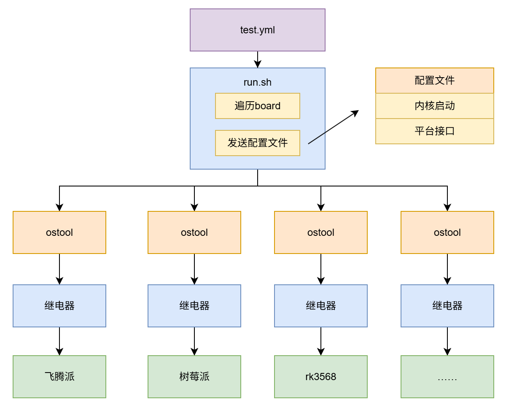

## 简介

axboard_test 是在本地服务器搭建的测试环境，本地服务器与 Github Action 以及各个测试设备连接，执行 Action 中的一系列测试步骤，然后结果分析测试结果，并将结果同步到 Github Action 中。

## 流程图




## 硬件平台

### aarch64

- [ ] Phytium-pi
- [ ] Raspi
- [ ] Rockchip RK3568 

### riscv64

- [ ] A
- [ ] B


## How to use

`temple.toml` 是平台相关的配置文件模板，在config的各平台中，根据实际环境配置平台相关的信息，并更名为 `.board.toml`

在 test.yml 调用 run.sh 脚本，脚本中遍历各个测试设备，执行测试，并将结果同步到 Github Action 中。

## 文件介绍

```
.
├── config
│   ├── phytiumpi-arceos
│   │   ├── arceos.bin								# 客户机镜像文件
│   │   ├── board_phytiumpi_arceos.toml				# 硬件平台配置项 (根据 temple.toml 新建)
│   │   └── vm_phytiumpi-arceos.toml				# 客户机配置文件
│   ├── phytiumpi-linux
│   │   ├── board_phytiumpi_linux.toml
│   │   ├── Image
│   │   ├── phytiumpi-linux.dtb
│   │   └── vm_phytiumpi-linux.toml
│   ├── rk3568-arceos
│   │   ├── arceos.bin
│   │   ├── board_rk3568_arceos.toml
│   │   └── vm_rk3568-aarch64.toml
│   └── rk3568-linux
│       ├── board_rk3568_linux.toml
│       ├── Image
│       ├── rk3568-linux.dtb
│       └── vm_rk3568-linux.toml
├── img
│   └── board_test.png
├── README.md
├── run.sh											# 启动脚本
└── temple.toml										# 硬件平台配置模板
```


## More
https://github.com/orgs/arceos-hypervisor/discussions/217
